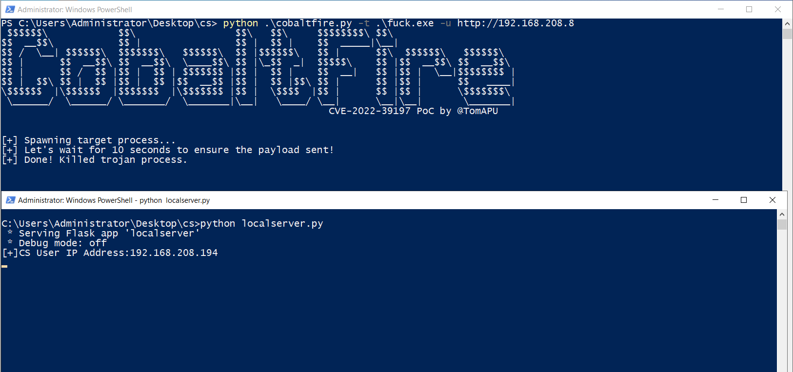
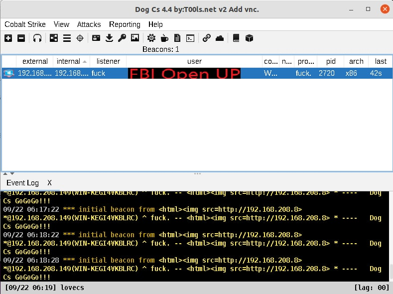

# 这是什么
CVE-2022-39197的POC

很显然大家想要能RCE的那种，但是我办不到，只能加载个图片钓钓大黑客的IP。



# 跑起来
```cmd
python .\cobaltfire.py -t .\fuck.exe -u http://192.168.208.8
```
其中t参数是木马，u参数是URL（长度必须小于等于20）。

再随便搞个服务器记录下IP就可以。

# 这个POC是怎么工作的
通过Frida运行木马，Hook GetUserNameA函数并返回XSS payload，让木马自己跑起来的时候把Payload发出去。

# 注意事项
**由于这个POC通过执行CobaltStrike生成的木马，请务必虚拟机运行!!!**

经过测试当前只支持X86 EXE的马，其它类型的请自己动手丰衣足食。